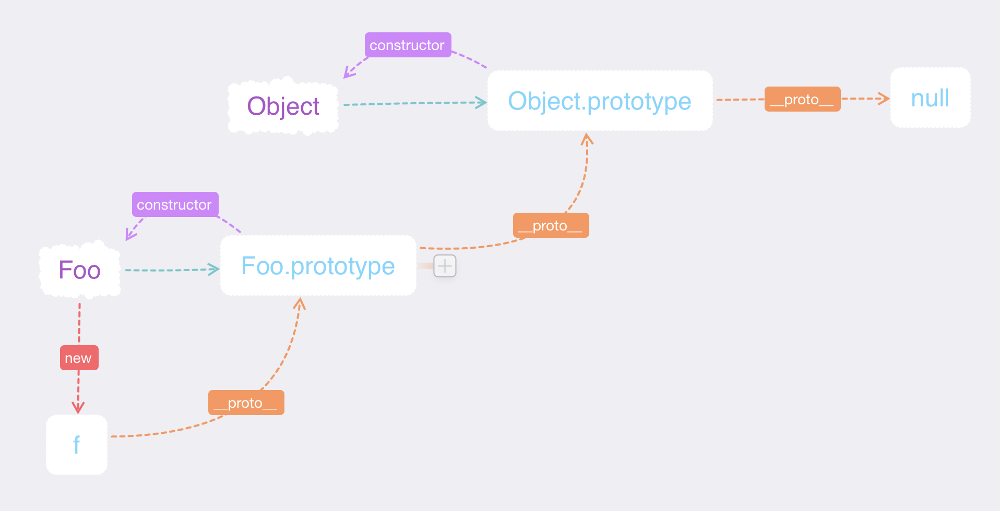

### JavaScript基础

* * *

#### 变量类型和计算

##### q:JS中使用 `typeof` 的类型？

1.  基本类型

```javascript
  `undefined` `null` `boolean` `number` `string`
```

2.引用类型

```javascript
  `object`
  `对象` `数组` `函数`
```

```javascript
  typeof undefined; //undefined
  typeof 'abc'; //string
  typeof 123; //number
  typeof true; //boolean
  typeof {}; //object
  typeof []; //object
  typeof null; //object 引用类型
  typeof console.log; //function
  //typeof 只能区分基本类型，无法区分对象、数组、null这三种引用类型
```

##### q:何时使用 `===` 何时使用 `==`

```javascript
  //字符串拼接类型转换
  var a = 100 + 10 //110
  var b = 100 + '10' //10010
```

```javascript
  // ==号
  100 == '100' //true
  0 == '' //true
  null == undefined //true
```

```javascript
  //if语句
  var a = true;
  if (a) {
    //
  }
  var b = 100;
  if (b) {
    //b=true
  }
  var c = '';
  if (c) {
    //c=false
  }
```

```javascript
  //逻辑运算符
  console.log(10 && 0) // 0
  console.log('' || 'abc') // 'abc'
  console.log(!window.abc) // true (当window.abc=undefined时)
  // 判断一个变量是被当做 `true` 还是 `false`
  var m = 100;
  console.log(!m) //false
  console.log(!!m) //true
```

```javascript
  // a:
  if (obj.a == null) {
    // 相当于obj.a=== null||obj.a=== undefined，简写形式
    // 这是jquery源码中推荐的写法
    // 其他情况全部使用 `===`
  }
```

##### q:JS中有哪些 `内置函数` -数据封装类对象

```javascript
Object
Array
Boolean
Number
String
Function
Date
RegExp
Error
```

##### q:JS按照 `存储方式` 区分为哪些类型，并描述其特点

```javascript
  //值类型
  var a = 10;
  b = a;
  a = 11;
  console.log(b) //10
  //复制不会相互干预
  ** ** ** ** ** ** ** ** ** *
  //引用类型
  var obj1 = { x: 100 };
  var obj2 = obj1;
  obj1.x = 200;
  console.log(obj2.x); //200
  // 复制是引用类型的指针，会相互干预
```

##### q:如何理解 `JSON`

```javascript
  // JSON只不过是一个内置的JS对象而已
  // JSON也是一种数据格式
  JSON.stringify({ a: 100, b: 200 }); // "{"a":100,"b":200}"
  JSON.parse('{"a":100,"b":200}'); // {a:100,b:200}
```

* * *

#### 原型&&原型链

###### 构造函数

```javascript
  function Foo(name, age) {
    this.name = name;
    this.age = age;
    this.class = 'class-1';
    //return this ; //默认有这一行
  }
  var f = new Foo('张三', 22);
  var f1 = new Foo('李四', 29);
```

###### 构造函数 - 扩展

```javascript
  var a={} 其实是 var a=new Object() 的语法糖
  var a=[] 其实是 var a=new Array() 的语法糖
  function Foo() {....} 其实是 var Foo=new Function(...)
  使用 instanceof 判断一个函数是否是一个变量的构造函数
```

###### 原型规则和示例

-   所有的引用类型(数组、对象、函数)，都具有对象属性(即可自有扩展的属性)，`null`除外
-   所有的引用类型(数组、对象、函数)，都有一个 `__proto__` 属性(隐式原型)，属性值是一个普通的对象

```javascript
  var obj = { };
  obj.x=100;
  console.log(obj.__proto__);
  // {constructor: ƒ, __defineGetter__: ƒ, __defineSetter__: ƒ, hasOwnProperty: ƒ, __lookupGetter__: ƒ, …}
  var arr = [];
  arr.x = 200;
  console.log(arr.__proto__);
  // [constructor: ƒ, concat: ƒ, find: ƒ, findIndex: ƒ, pop: ƒ, …]
  function fn() {};
  fn.x = 300;
  console.log(fn.__proto__);
  // ƒ () { [native code] }
  var d = null;
  console.log(d.__proto__);
  // Uncaught TypeError: Cannot read property '__proto__' of null
```

-   所有的 `函数` ，都有一个 `prototype` 属性(显式原型)，属性值也是一个普通对象

```javascript
  console.log(fn.prototype);
  // {constructor: ƒ}
```

-   所有的引用类型(数组、对象、函数), `__proto__` 属性值指向它的构造函数的 `prototype` 属性值

```javascript
  console.log(obj.__proto__ === Object.prototype);
  // true
```

-   当视图得到一个对象(所有的引用类型)的某个属性时，如果这个对象本身没有这个属性，那么会去它的 `__proto__` (即它的构造函数的 `prototype` )中寻找。

```javascript
  // 构造函数
  function Foo(name, age) {
    this.name = name;
  }
  Foo.prototype.alertName = function() {
    console.log('alertName' + this.name);
  }
  // 创建示例
  var f = new Foo('张三');
  f.prientname = function() {
    console.log('prientname' + this.name);
  }
  // 测试
  f.prientname(); // prientname张三
  f.alertName(); // alertName张三
```

###### 原型链

```javascript
  // 构造函数
  function Foo(name, age) {
    this.name = name;
  }
  Foo.prototype.alertName = function() {
    console.log('alertName' + this.name);
  }
  // 创建示例
  var f = new Foo('张三');
  f.prientname = function() {
    console.log('prientname' + this.name);
  }
  // 测试
  f.prientname(); // prientname张三
  f.alertName(); // alertName张三

  f.toString(); // "[object Object]" 在f.__proto__.__proto__中查找，即Object的显式原型中寻找
```



###### instanceof

-   `instanceof` 用于判断 `引用类型` 属于哪个 `构造函数` 的方法

```javascript
  // f的 __proto__ 一层一层网上找，找到对应的 Foo.prototype
  f instanceof Foo //true
  f instanceof Object //true
```

##### q:如何准确判断一个变量是数组类型

```javascript
  var arr=[]
  // 可以正确判断的情况
  arr instanceof Array //true
  Object.prototype.toString.call(arr) // "[object Array]"
  Object.prototype.toString.apply(arr) // "[object Array]"
  Array.isArray(arr) // true
  // 不能判断的情况
  typeof arr // object 是无法判断是否是数组的
  // 不准确
  arr.constructor === Array //true 但是原型链可以被改写，这样判断不安全
```

```javascript
  // 扩展 兼容老版本浏览器，isArray的写法
  if(!Array.isArray){
    Array.isArray = function(arg){
      return Object.property.toString.call(arg) === '[object Array]'
    }
  }
```

##### q:写一个原型链继承的例子

```javascript
  function Elem(id) {
    this.elem = document.getElementById(id);
  }
  Elem.prototype.html = function(val) {
    var elem = this.elem;
    if (val) {
      elem.innerHTML = val;
      return this; // 后续的链式操作
    } else {
      return elem.innerHTML;
    }
  }
  Elem.prototype.on = function(type, fn) {
    var elem = this.elem;
    elem.addEventListener(type, fn);
    return this;
  }
  var main = new Elem('main')
  main.html('<p>Hello World</p>').on('click', function() {
    alert('Hello javascript')
  })
```

##### q:描述 `new` 一个对象的过程

-   创建一个对象
-   `this` 指向这个新对象
-   执行代码，即对 `this` 赋值
-   返回 `this`

```javascript
  function Foo(name, age) {
    this.name = name;
    this.age = age;
    this.class = 'class-1';
    //return this ; //默认有这一行
  }
  var f = new Foo('张三', 22);
  var f1 = new Foo('李四', 29);
```

* * *

#### 数组API

##### `栈方法` (后进先出)

> 在栈的顶部进行插入和移除操作，使用 `push` 和 `pop` 方法结合（会修改原始数组）

-   在数组末尾插入(push可以添加多项) `push`

    ```javascript
    var arr=[1,2,3];
    var m=arr.push('m');
    console.log(m);  // 4 ，插入末尾，并返回修改后数组的长度
    console.log(arr); // [1, 2, 3, "m"]
    ```

-   移除最后一项 `pop`
        ```javascript
        var arr=[1,2,3];
        var n=arr.pop();
        console.log(n);  // 3 移除最后一项，并返回这一项
        console.log(arr); // [1, 2]
        ```

##### `队列方法` (先进先出)

> 使用 `shift` 方法(移除数组第一个项并返回该项，用时数组长度减1)结合 `push` ，就可以像操作队列一样操作数组（会修改原始数组）

-   移除数组第一个项并返回该项 `shift`
    ```javascript
    var arr=[1,2,3];
    var s=arr.shift();
    console.log(s);  // 1 移除第一项，并返回这一项
    console.log(arr); // [2, 3]
    ```
-   在数组前端添加任意个项并返回新数组的长度 `unshift`,使用 `unshift` 和 `pop`可以从相反的方向来模拟队列
    ```javascript
    var arr=[1,2,3];
    var l=arr.unshift(4,5);
    console.log(l);  // 5 向数组前端添加两项，并返回修改后的数组长度
    console.log(arr); // [4, 5, 1, 2, 3]
    ```

##### `重排序方法` （会修改原始数组）

-   `reverse`

    ```javascript
    var arr=[1,2,3];
    arr.reverse();
    console.log(arr); // [3,2,1]
    ```

-   `sort`

    ```javascript
    var arr=[1,8,10,22,31,3];
    arr.sort();
    console.log(arr); // [1, 10, 22, 3, 31, 8]
    ```

    >  `sort`并没有像我们预期的进行排序， `sort` 排序时，会调用数组每一项的 `toString()` 方法，即使数组的所有项都是数字，也是转换成字符串进行比较的，一般 `sort` 方法会接受一个比较函数，以便我们进行排序。

    ```javascript
    var arr = [1, 8, 10, 22, 31, 3];

    function compare(v1, v2) {
      if (v1 < v2) {
        return -1;
      } else if (v1 > v2) {
        return 1;
      } else {
        return 0;
      }
    }
    arr.sort(compare);
    console.log(arr); // [1, 3, 8, 10, 22, 31]
    // 比较函数还可以这样写
    function compare(v1, v2) {
      return v1 - v2;
    }
    ```

>   `reverse` 和 `sort` 的返回值是经过排序后的数组;

##### `操作方法`

-   `concat` 基于当前数组的所有项创建一个新数组 (不会修改原数组)
    ```javascript
    var arr = ['a', 'b', 'c']
    // 当添加空数组时
    var arr1 = arr.concat([]);
    var arr2 = arr.concat();
    // 添加普通项
    var arr3 = arr.concat('');
    var arr4 = arr.concat(null, undefined);
    var arr5 = arr.concat('d');
    // 添加数组
    var arr6 = arr.concat(['d', 'e', 'f']);
    // 添加普通项和数组
    var arr7 = arr.concat('m', 'n', ',', ['d', 'e', 'f']);
    // 添加子项为数组的数组
    var arr8 = arr.concat(['d', 'e', 'f', ['x', 'y']]);
    // 添加两个数组
    var arr9 = arr.concat(['m', 'n', ','], ['d', 'e', 'f']);
    console.log(arr)  // ["a", "b", "c"]
    console.log(arr1) // ["a", "b", "c"]
    console.log(arr2) // ["a", "b", "c"]
    console.log(arr3) // ["a", "b", "c", ""]
    console.log(arr4) // ["a", "b", "c", null, undefined]
    console.log(arr5) // ["a", "b", "c", "d"]
    console.log(arr6) // ["a", "b", "c", "d", "e", "f"]
    console.log(arr7) // ["a", "b", "c", "m", "n", ",", "d", "e", "f"]
    console.log(arr8) // ["a", "b", "c", "d", "e", "f", Array(2)]
    console.log(arr9) // ["a", "b", "c", "m", "n", ",", "d", "e", "f"]
    ```
-   `slice` 基于当前数组中的一或多个项创建一个新数组，返回值是新数组(会修改原数组)

    -   `删除` 需要两个参数，起始位置和要删除的项数
        ```javascript
        // 从第三项开始，删除0项
        var arr = ['a', 'b', 'c', '1', '2', 's']
        var arr1 = arr.splice(3, 0)
        console.log(arr); // ['a', 'b', 'c', '1', '2', 's']
        console.log(arr1); // []
        // 从第三项开始，删除2项
        var arr = ['a', 'b', 'c', '1', '2', 's']
        var arr2 = arr.splice(3, 2)
        console.log(arr); // ["a", "b", "c", "s"]
        console.log(arr2); //  ["1", "2"]
        // 起始值大于数组长度
        var arr = ['a', 'b', 'c', '1', '2', 's']
        var arr3 = arr.splice(7, 1)
        console.log(arr);
        console.log(arr3);
        // 为负数的情况 从倒数项开始计算
        var arr = ['a', 'b', 'c', '1', '2', 's']
        var arr4 = arr.splice(-2, 2)
        console.log(arr); // ["a", "b", "c", "1"]
        console.log(arr4); // ["2", "s"]
        // 项数为负，返回为空
        var arr = ['a', 'b', 'c', '1', '2', 's']
        var arr5 = arr.splice(2,-2)
        console.log(arr); // ["a", "b", "c", "1", "2", "s"]
        console.log(arr5);// []
        ```
    -   `插入` 需要三个参数，起始位置、要删除的项数(0)和要插入的项

        ```javascript
        // 不删除，插入
        var arr = ['a', 'b', 'c', '1', '2', 's']
        var arr2 = arr.splice(2,0,'x')
        console.log(arr); //["a", "b", "x", "c", "1", "2", "s"]
        console.log(arr2); // []
        ```

    -   `替换` 需要三个参数，起始位置、要删除的项数(0)和要插入的项

        ```javascript
        // 删除并插入
        var arr = ['a', 'b', 'c', '1', '2', 's']
        var arr1 = arr.splice(2,2,'x')
        console.log(arr); // ["a", "b", "x", "2", "s"]
        console.log(arr1); //  ["c", "1"]
        // 插入数组
        var arr = ['a', 'b', 'c', '1', '2', 's']
        var arr3 = arr.splice(2, 0, 'x', [1, 2, 3])
        console.log(arr); // ["a", "b", "x", Array(3), "c", "1", "2", "s"]
        console.log(arr3); // []
        ```

##### `位置方法`

>   `参数` 要查找的项和起始位置(可选)，查找的项用 `===` 操作，必须完全相等，查找到，返回位置下标，未找到，返回 `-1`
>
> -   `indexOf` 从数组开始位置向后查找
> -   `lastIndexOf` 从数组末尾向前查找

##### `迭代方法`

>  `参数` 两个参数，要在每一项上运行的函数和运行该函数的作用域对象(可选)——影响 `this` 的值；
>
> -   `some` 对数组中的每一项运行给定函数，如果任一项都返回 `true`,则返回 `true`;
> -   `every` 对数组中的每一项运行给定函数，如果每一项都返回 `true`,则返回 `true`;
> -   `filter` 对数组中的每一项运行给定函数，返回该函数返回值为 `true` 的项所组成的数组;
>     ```javascript
>     var arr = [-1, 22, 4, -2, 19, 0]
>     var result = arr.filter(function(ele, index, arr) {
>       return (ele > 0)
>     })
>     console.log(arr); // [-1, 22, 4, -2, 19, 0]
>     console.log(result); // [22, 4, 19]
>     ```
> -   `forEach` 对数组中的每一项运行给定函数，该方法没有返回值;
> -   `map` 对数组中的每一项运行给定函数，返回该函数每次调用结果组成的数组;(如果map函数中没有 `return` ，则返回一个长度等于元素组的值为 `undefined` 的数组)
>     ```javascript
>     var arr = [-1, 22, 4, -2, 19, 0]
>     var result = arr.map(function(ele, index, arr) {
>       return (ele * 2)
>     })
>     console.log(arr); // [-1, 22, 4, -2, 19, 0]
>     console.log(result); // [-2, 44, 8, -4, 38, 0]
>     ```

##### `归并方法`(ES5新增) 两个方法都会迭代数组所有项，然后构建一个最终返回的值。

> 参数:在每一项上调用的函数和作为归并基础的初始值(可选的)。改函数接收4个参数：前一个值、当前值、项的索引和数组对象。

-   `reduce` 从数组第一项开始，逐个遍历到最后
-   `reduceRight` 从数组最后一项开始，逐个遍历到最后
    ```javascript
    // 一个数组自动求和方法
    var arr = [1, 2, 3, 4, 5]
    var result = arr.reduce(function(pre, cur, index, arr) {
      return pre + cur
    }, 0)
    console.log(arr); //[1, 2, 3, 4, 5]
    console.log(result); //15
    ```
    ```javascript
    // 计算一个数组中，同一个字符出现的次数(当然for循环也很容易实现)
    var arr = ['A','B', 'C', 'A', 'D', 'C', 'B', 'E', 'C', 'D']
    var result = arr.reduce(function(pre, cur, index) {
      pre[cur] = pre[cur] ? ++pre[cur] : 1;
      return pre;
    }, {})
    console.log(result); // {A: 2, B: 2, C: 3, D: 2, E: 1}
    ```

* * *
