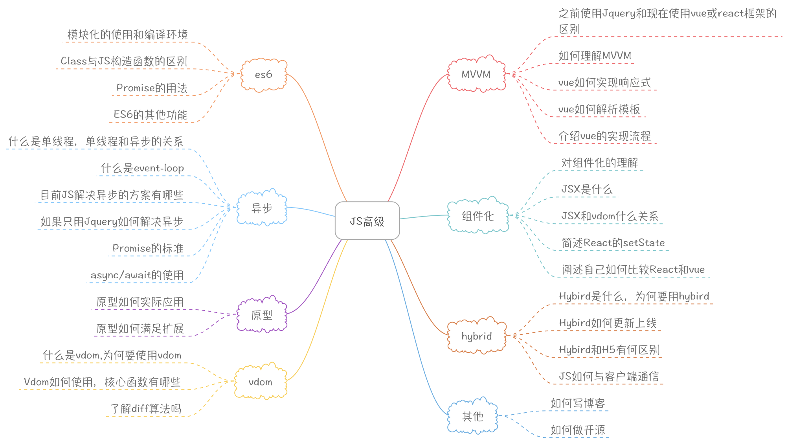
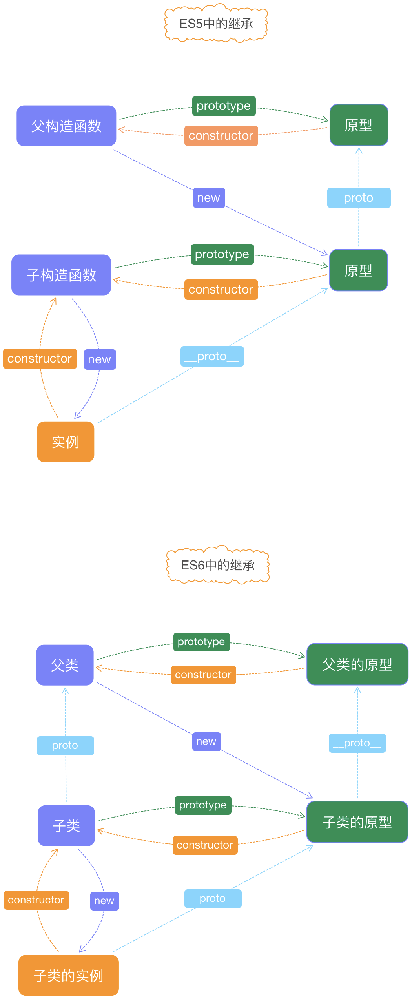

## JS高级-ES6基础

### 图解



### ES6

-   概况

    -   开发环境已经普及使用
    -   浏览器环境却支持不好(需要开发环境编译)
    -   内容很多，重点了解常用语法

-   问题

    -   ES6模块化如何使用，开发环境如何打包
    -   Class和普通构造函数有何区别
    -   Promise的基本使用和原理
    -   总结一下ES6的常用功能

-   ES6模块化如何使用，开发环境打包

    -   `import` 和 `export`

        ```javascript
          // util1
          export default {
            a: 100
          }
          // util2
          export function fn1() {
            console.log('fn1');
          }
          export function fn2() {
            console.log('fn2');
          }

          // 使用
          import util1 from './util1.js'
          import {fn1,fn2} from './util2.js'

          console.log(util1);
          fn1();
          fn2();
        ```

    -   开发环境 —— `babel`
        ```shell
          //安装npm模块，编译es6文件
          cnpm i babel-core babel-preset-es2015 babel-preset-latest -D
        ```
    -   开发环境 —— `webpack`（功能强大）
    -   开发环境 —— `rollup`（打包模块化,功能单一）

-   ES6中 `Class`

    -   JS构造函数

        ```javascript
        // 构造函数
        function MathHandle(x, y) {
          this.x = x;
          this.y = y;
        }
        // 原型扩展
        MathHandle.prototype.add = function(x, y) {
          return this.x + this.y;
        }
        // 实例化
        var m = new MathHandle(1, 2);
        console.log(m.add());
        ```

    -   Class基本语法

        ```javascript
        // Class语法
        class MathHandle {
          // 构造器
          constructor(x, y) {
            this.x = x;
            this.y = y;
          }
          add() {
            return this.x + this.y
          }
        }
        const m = new MathHandle(1, 2);
        console.log(m.add());
        ```

    -   语法糖

        ```javascript
        // 本质和构造函数一样
        class MathHandle {
        //
        }
        typeof MathHandle // 'function'
        MathHandle === MathHandle.prototype.constructor // true
        const m = new MathHandle(1,2);
        m.__proto__ === MathHandle.prototype // true
        ```

    -   继承

        ```javascript
        // ES5继承
        // 动物
        function Animal() {
          this.eat = function() {
            console.log('animal eat');
          }
        }
        // 狗
        function Dog() {
          this.bark = function() {
            console.log('dog bark');
          }
        }
        // 继承
        Dog.prototype = new Animal();
        // hashiqi
        var hashiqi = new Dog();
        hashiqi.bark();
        hashiqi.eat();
        ```


        Dog.prototype.__proto__ === Animal.prototype //true
        // ES6继承
        class Animal {
          constructor(name) {
            this.name = name;
          }
          eat() {
            console.log(`${this.name} eat`);
          }
        }
        class Dog extends Animal {
          constructor(name) {
            super(name);
            this.name = name;
          }
          say() {
            console.log(`${this.name} say`);
          }
        }
        const dog = new Dog('哈士奇');
        dog.say();
        dog.eat();
        ```

  

-   Promise

    -   Callback Hell

        ```javascript
          // Callback Hell
          function LoadImg(src, success, fail) {
            var img = document.createElement('img');
            img.onload = function() {
              success(img);
            }
            img.onerror = function() {
              fail();
            }
            img.src = src;
          }

          var src = 'https://www.imooc.com/static/img/index/logo_new.png'
          LoadImg(src, function(img) {
            console.log(img.width);
          }, function() {
            console.log('fail');
          })
        ```

    -   Promise 语法
        ```javascript
          // Promise
          function loadImg(src) {
            const promise = new Promise(function(resolve, reject) {
              let img = document.createElement('img');
              img.onload = function() {
                resolve(img);
              }
              img.onerror = function() {
                reject();
              }
              img.src = src;
            })
            return promise;
          }
          const src = 'https://www.imooc.com/static/img/index/logo_new.png';
          const result = loadImg(src)
          result.then(function(img) {
            console.log(img.width);
          }, function() {
            console.log('fail');
          })
        ```

-   ES6其他

    -   `let` / `const`

        -   let 声明一个变量,重复声明会报错，值可以改变，不存在变量提升，声明只在let所在的代码块内有效；

    -   多行字符串/模板变量

        ```javascript
        // es5
        var html = '<div>' +
          '<span>32</span>' +
          '</div>'

        // es6
        const name='zhangsan', age = 32;
        const html = `
                    <div>
                      <span>${name}</span>
                      <span>${age}</span>
                    </div>
                    `
        ```

    -   解构赋值

        ```javascript
          // es5
          var obj = {
            a: 100,
            b: 200
          }
          var a = obj.a;
          var b = obj.b;

          var arr = ['xxx', 'yyy', 'zzz']
          var x = arr[0];
          var y = arr[1];
          var z = arr[2];

          // es6
          const obj = {
            a: 100,
            b: 200
          }
          const {
            a,
            b
          } = obj;

          console.log(a); // 100
          console.log(b); // 200

          const arr = ['xxx', 'yyy', 'zzz'];
          const [x, y, z] = arr;
          console.log(x); // xxx
          console.log(y); // yyy
          console.log(z); // zzz
        ```

    -   块级作用域

        ```javascript
          //  ES5
          var obj = {
            a: 100,
            b: 200
          }
          // 不推荐写法
          for (var item in obj) {
            console.log(item);
          }
          console.log(item); // b

          // ES6
          const obj = {
            a: 100,
            b: 200
          }
          for (let item in obj) {
            console.log(item);
          }
          console.log(item); // item is not defined
        ```

    -   函数默认参数

        ```javascript
          //ES5
          function log(x, y) {
            y = y || 'World';
            console.log(x, y);
          }
          log('Hello') // Hello World
          log('Hello', 'China') // Hello China
          log('Hello', '') // Hello World
          // ES6
          function log(x, y = 'World') {
            console.log(x, y);
          }
          log('Hello') // Hello World
          log('Hello', 'China') // Hello China
          log('Hello', '') // Hello

          function Point(x = 0, y = 0) {
            this.x = x;
            this.y = y;
          }
          const p = new Point();
          p // { x: 0, y: 0 }
        ```

    -   箭头函数
        ```javascript
          // 箭头函数 this 指向
          //  ES5
          function fn() {
            console.log('real', this); // real {a:100}
            var arr = [1, 2, 3];
            arr.map(function(item) {
              console.log(item, this); // 1 window
            })
          }
          var obj = {
            a: 100
          }
          fn.call(obj)

          // ES6
          function fn() {
            console.log('real', this); // real {a:100}
            const arr = [1, 2, 3];
            arr.map(item => {
              console.log(item, this); // 1 {a:100}
            })
          }
          const obj = {
            a: 100
          }
          fn.call(obj)
        ```
        -   函数体内的 `this` 对象，就是定义时所在的对象，而不是使用时所在的对象
        -   不可以当作构造函数，也就是说，不可以使用 `new` 命令，否则会抛出一个错误
        -   不可以使用 `arguments` 对象，该对象在函数体内不存在。如果要用，可以用 rest 参数代替
        -   不可以使用 `yield` 命令，因此箭头函数不能用作 `Generator` 函数
